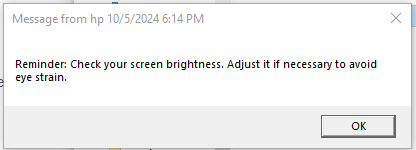

# Eye Protection

A batch script that helps developers protect their eyes from prolonged screen exposure by providing regular reminders to take breaks. This script follows the 20-20-20 rule: every 20 minutes, look at something 20 feet away for 20 seconds. It also encourages longer breaks and suggests adjusting screen brightness.

You mom may not always everywhere with you to remind you to go out and leave you screen :)

## Features

- **20-20-20 Rule Reminders**: Notifies the user every 20 minutes to take a short break and rest their eyes.
- **Extended Breaks**: After every 80 minutes (4 short breaks), the script prompts the user to take a longer 10-15 minute break.
- **Brightness Check**: After every hour, the script reminds the user to check and adjust the screen brightness to match the surrounding light conditions.
- **Simple & Lightweight**: The script is written in batch and can be easily run on any Windows system.

## How to Use

1. Clone this repository or download the `eye_protection.bat` file directly.
   
   ```bash
   git clone https://github.com/Naveen-Pal/eye-protection.git
   ```

2. Run eye_protection.bat file

    Below is the sample pop-up
    